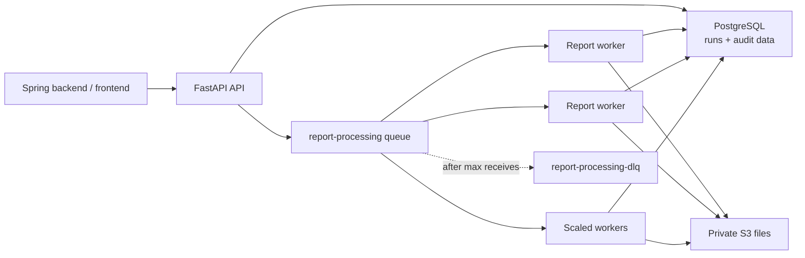

# Final implementation plan — Sprint 1

Build a FastAPI service in `D:\MHN-AI` for **report-only** auto-classification, data extraction, insight
generation, and AI cost logging.

Architecture: one SQS queue + independently scalable report workers. We will **not** use separate queues
per pipeline stage or document type.

Out of scope this sprint: scans, imaging, insurance, prescriptions, multi-document-type routing.



---

## 1. Database

The FastAPI service shares the `mhn_ai` PostgreSQL database with the Spring backend. Spring owns the
base schema; this service owns only the `ai_*` tables and the `reports.content` AI payload.

**Setup:**

1. ~~Stand up PostgreSQL.~~ **Done** — `docker compose --profile localdev up -d db`.
2. ~~Create `mhn_ai` and import [`index.sql`](D:\mhn-spring\migrations\index.sql).~~ **Done** — verified
   2026-07-22: 31 tables, 20 enum types, init script logged no errors.
3. Run Alembic migrations for the service-owned tables below. ← next

This must be the same database the Spring backend runs against, since this service writes
`reports.content`. It follows that migrations here are never destructive to non-`ai_*` tables.

### Where Postgres lives

Verified on 2026-07-22: **no Postgres is running and no MHN database exists.** Nothing listens on
`:5432`, `psql` is not on `PATH`, and no MHN volume exists. The credentials in
`D:\mhn-spring\.env.example` are dummy placeholders, not a live database to match.

**Resolved topology:** MHN-AI's Compose owns a `db` service (`postgres:17-alpine`) that publishes
`5432`, with `mhn_ai` created and `index.sql` imported by an init script on first boot. The Spring
backend points at this same instance for integration testing. One Postgres, one `mhn_ai` database, both
applications — required anyway for the shared `reports` table.

The local database is **disposable scaffolding**. It gets replaced by the real application database once
testing is done, so it is scoped as a Compose profile:

```
docker compose --profile localdev up      # api + worker + db + localstack
docker compose up                          # api + worker only, pointed at real infrastructure
```

Swapping to the real database is a `DATABASE_URL` change and nothing else — same rule as the
LocalStack → AWS swap. Therefore: no hardcoded database name, host, port, or credentials anywhere in the
codebase; no code path may assume Postgres is reachable by the Compose service name `db`; and Alembic
reads the same `DATABASE_URL` as the app rather than carrying its own connection string in
`alembic.ini`.

> **Port conflicts on this machine.** The unrelated `health-ai-prototype` stack claims both `5432`
> (`health-ai-postgres`, stopped) and `8000` (`health-ai-api`, running). Every host port is therefore
> overridable: `POSTGRES_HOST_PORT`, `API_HOST_PORT`, `LOCALSTACK_HOST_PORT`. Local `.env` currently
> runs the API on **8010** because 8000 is occupied.

> **Schema drift.** `application.properties:6` sets `spring.jpa.hibernate.ddl-auto=update`, so Spring
> mutates the schema from its JPA entities at every startup. `update` never drops, so our `ai_*` tables
> are safe — but the live `reports` shape may drift from `index.sql`. Verify the live table after the
> first Spring boot rather than trusting `index.sql:609` alone.

### Identifier types (locked to the Spring schema)

| Thing | Type | Source |
|---|---|---|
| `reports.id` | `integer` (serial4) | `index.sql:609` ✔ verified in live DB |
| `reports.filepath` | `varchar(500)` — the S3 object key | `index.sql:612` ✔ verified |
| `reports.content` | `jsonb`, nullable | `index.sql:614` ✔ verified |
| `reports.user_id` | `uuid` | `index.sql:611` ✔ verified |
| `ai_processing_runs.id` | `uuid` | service-owned |

So: **run IDs are UUIDs, report IDs are integers.** API paths and Pydantic models must reflect this
(`report_id: int`, `run_id: UUID`). `reports` carries no content-type, size, or status column — all file
validation is done against S3, not the database.

### Service-owned tables (Alembic)

| Table | Purpose |
|---|---|
| `ai_processing_runs` | one user/API batch request |
| `ai_processing_run_items` | per-report status, stage, attempt count, idempotency key |
| `ai_report_classifications` | report / not-report result, title, confidence |
| `ai_report_extractions` | validated structured extraction result |
| `ai_report_insights` | generated informational insights |
| `ai_process_logs` | provider, model, prompt/schema version, tokens, duration, cost, outcome, sanitized error |

**Alembic must be scoped.** Since Spring's tables live in the same database, `include_object` ignores
any table not prefixed `ai_`, otherwise `--autogenerate` emits `DROP TABLE` for every Spring table.
Never use `create_all()` at startup.

Implemented in `app/core/migration_scope.py` rather than `alembic/env.py`, because `env.py` can only be
imported inside a live Alembic run and this logic is load-bearing enough to need unit tests. Verified
2026-07-22 two ways: 13 unit tests covering owned/foreign/lookalike-prefix names, and a real
`alembic revision --autogenerate` against the live 31-table database, which produced an **empty**
migration (0 `drop_table` calls). Alembic's version table is `ai_alembic_version`, keeping even the
bookkeeping inside the owned namespace.

### Writing `reports.content`

`reports.content` is a shared column Spring also reads and may write. The AI payload is written under a
dedicated key rather than replacing the object:

```json
{ "ai": { "schema_version": "1.0", "classification": {...}, "extraction": {...}, "insights": [...], "generated_at": "..." } }
```

Write it with a JSONB merge (`content = coalesce(content, '{}'::jsonb) || :ai_payload`) so unrelated
Spring keys survive. **Open question for Spring team:** confirm the key name and whether Spring expects
a flat shape instead.

---

## 2. API endpoints

All under `/v1`, Pydantic v2 request/response models, stable machine-readable error bodies.

| Method | Path | Purpose |
|---|---|---|
| `POST` | `/v1/report-processing-runs` | Submit one or many report IDs → `202 Accepted` |
| `GET` | `/v1/report-processing-runs/{run_id}` | Batch progress + each report's stage |
| `GET` | `/v1/reports/{report_id}/ai-result` | Classification, extraction, insights, metadata |
| `POST` | `/v1/reports/{report_id}/ai-result:retry` | Retry a failed report |
| `DELETE` | `/v1/report-processing-runs/{run_id}` | Cancel unfinished items |
| `GET` | `/health` | Liveness — no dependency calls |
| `GET` | `/ready` | Readiness — DB, SQS, S3 reachability |

The API returns quickly with `202 Accepted`; callers poll the run endpoint while workers process
documents. No long-running AI work inline, and no FastAPI `BackgroundTasks` for durable work.

Error bodies use a fixed shape (`{"error": {"code": "...", "message": "...", "details": {...}}}`) and
never expose stack traces, prompts, secrets, or raw S3 keys beyond authorized internal use.

**Authentication — needs a decision before coding.** This service is called by the Spring backend, not
by browsers. Proposed: a shared service token (`Authorization: Bearer <MHN_SERVICE_TOKEN>`) plus a
required `user_id` in the submit body, validated against `reports.user_id` so one tenant's reports can
never be processed under another's run. Confirm before implementing.

---

## 3. Processing lifecycle

```
pending -> queued -> processing -> classifying -> extracting -> generating_insights -> completed
```

Terminal alternatives: `failed`, `rejected`, `cancelled`.

Each `ai_processing_run_items` row carries `status`, `attempt_count`, `last_error_code`,
`idempotency_key`, and `updated_at`. Transitions are written with the row locked
(`SELECT ... FOR UPDATE`), and every write is idempotent because SQS delivers at least once.

### Idempotency

- Unique key: `(report_id, content_hash)` where `content_hash` is the S3 ETag/checksum, plus a **partial
  unique index** on `report_id` restricted to non-terminal statuses — so a report can never have two
  active items.
- A duplicate submission returns the existing active item (`202` with the same run/item) rather than
  enqueueing again.
- A completed result is never overwritten unless the request sets `force_reprocess: true`.

### Per-report flow

1. Validate the `reports` row exists and belongs to the caller's `user_id`.
2. `HeadObject` on `filepath` → verify existence, `ContentType` against the allowlist, and
   `ContentLength` against `MAX_FILE_BYTES`. (The DB has no size/type columns; S3 is the only source.)
3. Create the idempotent processing item (`pending`).
4. Publish one message to the report-processing queue → `queued`.
5. Worker receives, claims the row → `processing`.
6. Classify report / not-report. Wrong document type → `rejected` with a reason code; no further stages.
7. Extract structured lab data (test name, value, unit, reference range, observed date, source context).
8. **Deterministic** normalization in application code — unit conversion and abnormal/out-of-range flags
   are computed by Python from the extracted value + range, never asked of the LLM.
9. Generate informational insights (no diagnosis, no emergency instruction, no medical certainty).
10. Persist per-stage results, then assemble and merge the final `reports.content` payload.
11. Mark `completed`, or `failed` with a sanitized error.

Every stage writes one `ai_process_logs` row: provider, model, prompt version, schema version, input and
output tokens, estimated cost, duration, outcome, sanitized failure data. Cost is computed from a
per-model price table in config, not hardcoded at call sites. Retries must not duplicate cost rows —
logs are keyed by `(item_id, stage, attempt)`.

### Cancellation

`DELETE` marks non-terminal items `cancelled`. Messages already in SQS cannot be recalled, so **workers
re-check item status before each stage** and exit cleanly (deleting the message) if the item is
`cancelled`.

### Recovery of interrupted work

A worker crash leaves an item stuck in `processing`/`classifying`/etc. Two mechanisms:

- **Heartbeat:** long stages extend SQS message visibility while running, so the message is not
  redelivered mid-flight.
- **Reaper:** a periodic sweep marks items whose `updated_at` is older than `STALE_ITEM_TIMEOUT` as
  retryable and re-enqueues them, bounded by `MAX_ATTEMPTS`.

---

## 4. Reliability and scaling

- One **standard** SQS queue for high-volume independent report jobs.
- Duplicate processing prevented by idempotency key + row lock.
- Dead-letter queue after `SQS_MAX_RECEIVE_COUNT` receives.
- Workers scale independently of FastAPI.
- Concurrency is bounded and env-configured: `WORKER_MAX_CONCURRENCY` (default `4`). Add worker replicas
  for bursts.
- A burst of 100 uploads is accepted immediately; completion time scales with total worker slots.
- Transient S3 / database / AI-provider failures retry with exponential backoff and jitter; validation
  failures and wrong-document-type are **not** retried.
- Invalid model output is never silently repaired — it is logged as a validation failure and retried or
  failed per policy.

---

## 5. AI provider

Anthropic Claude via the `anthropic` SDK, using structured output validated by Pydantic before any
database write. Every prompt carries an explicit `prompt_version` and `schema_version` recorded in
`ai_process_logs`, so output shape changes are traceable. The provider sits behind an interface
(`AIProvider`) injected as a dependency, so it can be swapped or mocked in tests. Model IDs and per-token
prices live in configuration.

Report contents and credentials are never written to stdout. Raw model responses are retained only where
audit/debugging requires it, in the database, not the log stream.

---

## 6. Unit normalization scope

Sprint 1 ships a **curated conversion table** covering the common lab units (mg/dL ↔ mmol/L for glucose
and cholesterol, g/dL ↔ g/L, ×10⁹/L ↔ /µL, etc.) rather than a general-purpose unit engine. Anything
outside the table is stored as-extracted with `normalized: false` and no abnormal flag — never guessed.
Full LOINC mapping is deliberately deferred.

---

## 7. Project structure

```
D:\MHN-AI
├── app
│   ├── main.py
│   ├── core            # settings, logging, errors
│   ├── api             # thin HTTP handlers, v1 routers
│   ├── services        # business logic
│   ├── workers         # SQS consumer + stage orchestration
│   ├── models          # SQLAlchemy 2.x
│   ├── schemas         # Pydantic v2
│   └── integrations    # s3, sqs, ai provider (behind interfaces)
├── alembic
│   ├── env.py          # include_object filter: ai_* tables only
│   └── versions
├── tests
│   ├── unit
│   └── integration
├── alembic.ini
├── pyproject.toml      # ruff + mypy + pytest config
├── Dockerfile          # one image, api and worker differ by command
├── docker-compose.yml  # api, worker, localstack (Postgres stays on the host)
├── scripts
│   ├── localstack-init.sh  # creates bucket, queue, DLQ + redrive policy
│   └── db-init/            # mounted into postgres init: creates mhn_ai, imports index.sql
├── requirements.txt
└── .env.example
```

Python 3.12+, FastAPI, SQLAlchemy 2.x, Alembic, Pydantic v2. Timezone-aware UTC timestamps everywhere.
Dependency injection for DB sessions, S3, SQS, and AI provider. No global mutable state.

### Configuration (`.env.example`)

`DATABASE_URL`, `AWS_REGION`, `AWS_ENDPOINT_URL`, `S3_BUCKET`, `S3_FORCE_PATH_STYLE`, `SQS_QUEUE_URL`,
`SQS_DLQ_URL`, `SQS_MAX_RECEIVE_COUNT`, `WORKER_MAX_CONCURRENCY`, `MAX_ATTEMPTS`,
`STALE_ITEM_TIMEOUT_SECONDS`, `MAX_FILE_BYTES`, `ALLOWED_CONTENT_TYPES`, `AI_PROVIDER`, `AI_MODEL`,
`AI_MAX_TOKENS`, `MHN_SERVICE_TOKEN`, `LOG_LEVEL`. No secrets or real credentials are committed.

---

## 7a. Docker and local environment

Compose runs **`api` + `worker`** always, plus **`db` + `localstack`** under the `localdev` profile so
both can be dropped when real infrastructure takes over.

```yaml
# sketch — api and worker share one image, differ only in command
services:
  api:        # uvicorn app.main:app
  worker:     # python -m app.workers.main   (docker compose up --scale worker=3)
  db:         # postgres:17-alpine  [profile: localdev]
              # init: create mhn_ai, import index.sql
  localstack: # S3 + SQS, bucket/queue/DLQ via init script  [profile: localdev]
```

Both throwaway services sit behind profiles for the same reason: **every dependency this service talks
to must be swappable by environment variable alone.** `DATABASE_URL` for Postgres, `AWS_ENDPOINT_URL`
for S3/SQS. No code changes on cutover, either one independently.

`worker` is scaled with `--scale worker=N` to exercise the parallel path, and `WORKER_MAX_CONCURRENCY`
bounds concurrency inside each replica.

### Swapping LocalStack → real AWS with zero code changes

This is a hard design constraint, not a nice-to-have. The **only** difference between local and real AWS
is environment variables:

- All boto3 clients are built in one factory (`app/integrations/aws.py`) that passes
  `endpoint_url=settings.aws_endpoint_url or None`. Unset ⇒ boto3 resolves real AWS endpoints. Nothing
  else in the codebase constructs a client.
- Credentials come from the default boto3 chain. Locally, dummy env keys for LocalStack; in AWS, an
  instance/task IAM role — no code path difference.
- `S3_FORCE_PATH_STYLE=true` locally (LocalStack needs it); real AWS accepts path style too, so this is
  a config toggle, never a branch.
- Queue and bucket are addressed **only** by `SQS_QUEUE_URL` / `SQS_DLQ_URL` / `S3_BUCKET`. No queue URL
  is ever constructed from account ID or region in code.
- No LocalStack-only behaviour is relied on. Anything LocalStack emulates loosely — DLQ redrive policy,
  visibility-timeout precision, presigned-URL signing — gets an integration test that is expected to be
  re-run once against real dev resources before switching over.

Switching to AWS dev = point the env vars at real resources and unset `AWS_ENDPOINT_URL`. Creating those
AWS resources requires your explicit approval first, per CLAUDE.md.

### Caching / Redis — decided against for Sprint 1

No Redis. Considered and rejected:

- **Result and status caching** — these are primary-key and indexed reads from Postgres, negligible next
  to LLM latency measured in seconds.
- **Distributed locking for idempotency** — a Redis lock cannot participate in the Postgres transaction,
  making it strictly weaker than the existing `SELECT ... FOR UPDATE` + partial unique index. Two
  mechanisms guarding one invariant is a source of double-processing bugs, not a defence against them.
- **Document dedupe** — already covered by the `content_hash` idempotency key.
- **Broker** — SQS.

Revisit when cross-worker AI-provider rate limiting is needed (shared token-bucket state is a real job
for Redis) or if run-status polling measurably loads the database. Adding it now would buy a container,
a `/ready` dependency, and a stale-data failure mode for no measurable latency win.

---

## 8. Testing

- **Unit** — state machine transitions, unit normalization, abnormal-flag calculation, cost computation.
- **Integration** — the real host `mhn_ai` Postgres, idempotency under concurrent submits, API status
  transitions, S3/SQS against LocalStack, AI provider faked at the interface. Tests create and roll back
  their own data; they must never mutate Spring-owned rows, since this database is shared.
- **End-to-end** — against the **real dev S3 bucket** (`ap-south-1`), the same one Spring uploads to, so
  a Spring upload flows straight through the pipeline. Needs AWS dev credentials locally. Two
  guardrails, since this is real infrastructure: the AI service requires only `s3:GetObject` and
  `s3:HeadObject` — never write or delete — and E2E runs use fixture reports we upload ourselves, not
  arbitrary existing objects. **Per CLAUDE.md this needs your explicit go-ahead before the first run
  that touches real patient files.**
- **Retry safety** — assert a redelivered SQS message produces no duplicate results and no duplicate
  `ai_process_logs` rows.

Format, lint, and type checks (ruff, mypy) run before any change is called complete.

---

## 9. Sprint-one delivery order

1. ~~Stand up Postgres, create `mhn_ai`, import the Spring schema.~~ **Done 2026-07-22.**
2. ~~Bootstrap FastAPI, Docker Compose (api + worker + LocalStack), configuration, health/ready checks,
   Alembic (with the `ai_*` scoping filter), and the test harness.~~ **Done 2026-07-22.**
3. Add processing-run models, migrations, and the REST API with auth.
4. Configure S3 integration, one SQS queue + DLQ, and idempotent job publishing.
5. Implement the scalable report worker loop with bounded concurrency and heartbeat.
6. Implement report-only auto-classification (including `rejected` for wrong document types).
7. Implement extraction, deterministic normalization, and persistence.
8. Implement insight generation.
9. Implement AI model and process-cost logging.
10. Add retry, cancellation, the stale-item reaper, OpenAPI docs, and end-to-end tests with sample
    reports.

Next sprint, scans, insurance, and prescriptions reuse this same API/job/worker framework without
introducing separate queues unless a workload truly needs isolation.

---

## Open questions

1. **Auth model** — is a shared service token the right fit, or does Spring forward a user JWT?
2. **`reports.content` shape** — does Spring expect the AI payload nested under `"ai"`, or flat?
3. **Approved file types and size cap** — PDF only, or PDF + JPEG/PNG? What is `MAX_FILE_BYTES`?
4. **AI provider/model** — confirm Claude, and confirm which model tier for classification vs extraction.
